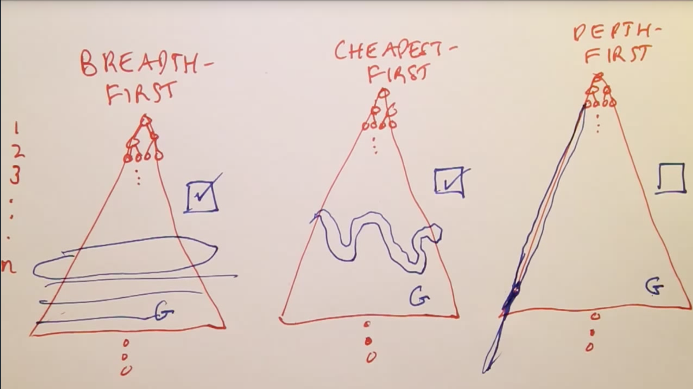

# Search Comparaison

- Completeness: if there is a goal, will the algorithm find it?
- Optimal: it will always find the shortest path.

## Breadth First Search
- Optimal: it finds the shortest path.
- Data Structures: The frontier will always have a length of n^2, since it saves the transversal nodes.
- Completeness: Yes. Even if the tree is infinite, eventually we will find the goal.

## Cheapest First Search
- Optimal: it finds the shortest path.
- Data Structures: The frontier will have a similar number of total nodes.
- Completeness: Yes. Even if the tree is infinite, eventually we will find the goal.

## Depth First Search
- Not Optimal: it does not always find the shortest path.
- Data Structures: The frontier will always have n nodes.
So, even it isn't optimal, if you need to save the paths in the frontier it requires less memory.
- Completeness: No. If the tree is infinite, it will keep following the path.
